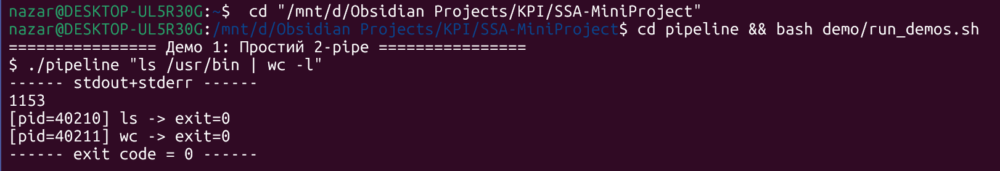
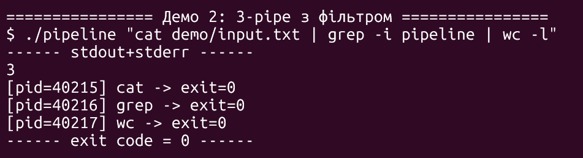
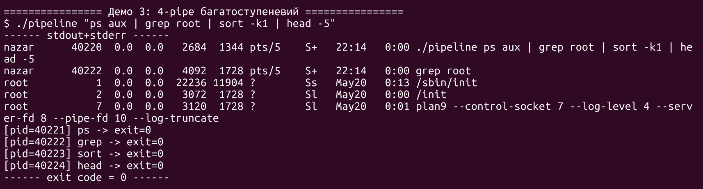
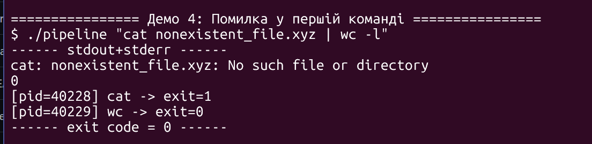
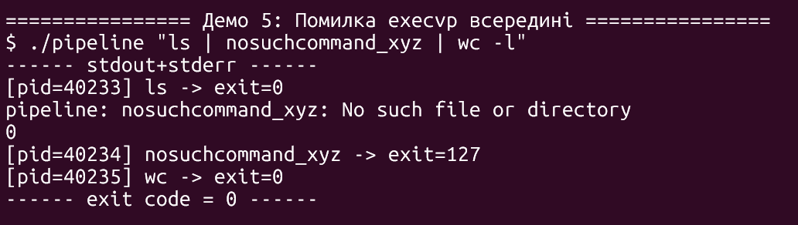
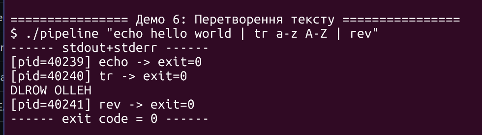
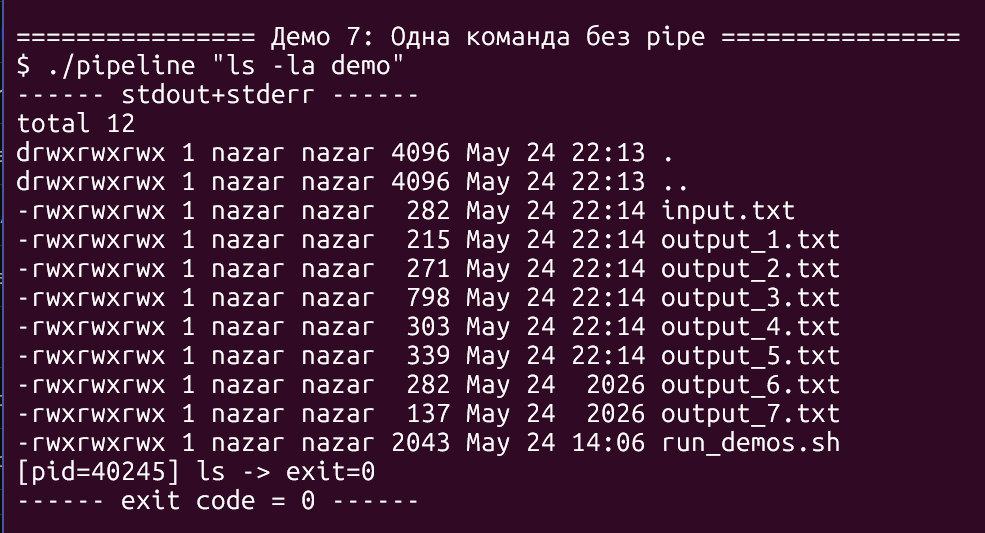
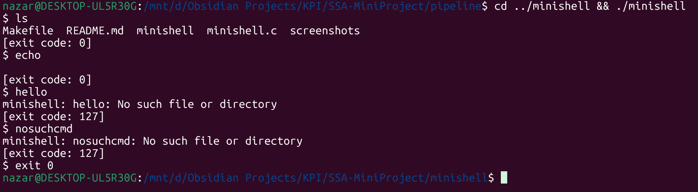

# Мініпроєкт АСПЗ — Варіант 11. Реалізація конвеєра команд

**Студент:** Степаненко Назар Юрійович
**Група:** ТВ-43
**Курс:** Архітектура системного програмного забезпечення (АСПЗ)
**Навчальний рік:** 2025/26, семестр 2
**Дата:** 2026-05-25
**GitHub:** [@d3Par1](https://github.com/d3Par1) — [ssa-mini-project](https://github.com/d3Par1/ssa-mini-project)

## Тема

Програмна реалізація аналога shell-конвеєра виду:
```bash
cat file.txt | grep word | wc -l
```
Програма самостійно створює потрібну кількість процесів, з'єднує їх через
ядерні канали (`pipe`) і перенаправляє стандартні потоки введення/виведення.

## Завдання (з методички)

> Створити програму, яка виконує аналог команди:
> `cat file.txt | grep word | wc -l`.
> Програма має самостійно створити процеси, канали між ними та
> перенаправити стандартні потоки.
> Бажано використати: `pipe()`, `fork()`, `dup2()`, `exec()`.

## Компіляція та запуск

```bash
make                                        # збирає бінарник pipeline
./pipeline "ls /usr/bin | grep gcc | wc -l" # запуск
make demo                                   # повний прогін усіх демо
make clean                                  # очистити артефакти
```

Цільова платформа — Ubuntu 22.04+. На Windows використовуйте WSL2
або Docker (див. кореневий README.md).

## Архітектура

```
                    ┌────────────────────────┐
   argv[1] -------->│  parent (pipeline)     │
   "a | b | c"      │  parse + create pipes  │
                    └────────┬───────────────┘
                             │
                pipe[0]      │      pipe[1]
              ┌─────────┐    │    ┌─────────┐
              │  fork x3 │   │
              ▼             ▼              ▼
   ┌────────────┐   ┌────────────┐   ┌────────────┐
   │ child[0]=a │   │ child[1]=b │   │ child[2]=c │
   │ stdin=term │   │ stdin=p0_r │   │ stdin=p1_r │
   │ stdout=p0_w│-->│ stdout=p1_w│-->│ stdout=term│
   │ execvp(a)  │   │ execvp(b)  │   │ execvp(c)  │
   └────────────┘   └────────────┘   └────────────┘

   Після forks parent ЗАКРИВАЄ всі fd пайпів і робить waitpid() по черзі.
```

Для N команд створюється **N процесів** та **N-1 пайпів**.
Кожен внутрішній процес (`i = 1..N-2`) є одночасно і читачем (з `pipes[i-1]`),
і писачем (у `pipes[i]`). Перший процес читає з терміналу (наш unmodified stdin),
останній — пише у термінал (наш unmodified stdout).

## Етапи виконання

1. **Парсинг** — рядок `argv[1]` розбивається за `'|'`, потім кожна підкоманда
   за пробілами. Реалізовано через `strtok_r` ([`pipeline.c:37`](pipeline.c#L37)).
2. **Створення пайпів** — `pipe(pipes[i])` у циклі для `i = 0..N-2`
   ([`pipeline.c:128`](pipeline.c#L128)).
3. **Форк-цикл** — для кожної команди `fork()`; у дитині відразу
   `dup2()` + `close()` усіх pipe-fd + `execvp()`
   ([`pipeline.c:139`](pipeline.c#L139)).
4. **Очищення в батьку** — `close_all_pipes()` одразу після останнього `fork`
   ([`pipeline.c:175`](pipeline.c#L175)).
5. **Очікування** — `waitpid()` по кожному `pid`, exit-код останньої команди
   стає кодом повернення pipeline ([`pipeline.c:179`](pipeline.c#L179)).

## Використані системні виклики

| Виклик | Призначення | Де у коді |
|---|---|---|
| `pipe(int fd[2])` | Створює анонімний однонаправлений канал у ядрі. `fd[0]` — read-end, `fd[1]` — write-end. | `pipeline.c:128` |
| `fork()` | Створює дочірній процес (точну копію батьківського address space + усі відкриті fd). Повертає 0 у дитині, PID у батьку, -1 при помилці. | `pipeline.c:140` |
| `dup2(oldfd, newfd)` | Робить `newfd` дублікатом `oldfd`; якщо `newfd` був відкритий — спершу закриває. Атомарна операція. | `pipeline.c:148, 154` |
| `close(fd)` | Звільняє файловий дескриптор. Якщо це останній fd, що вказує на pipe-end, ядро надсилає EOF/SIGPIPE іншому кінцю. | `pipeline.c:63, 159, 175` |
| `execvp(file, argv)` | Замінює образ поточного процесу на нову програму (PID не змінюється). Шукає `file` у `$PATH`. У разі успіху НЕ повертається. | `pipeline.c:161` |
| `waitpid(pid, &status, 0)` | Блокує батька до завершення дитини `pid`, повертає її статус через `WIFEXITED`/`WEXITSTATUS`/`WIFSIGNALED`/`WTERMSIG`. | `pipeline.c:181` |
| `_exit(int code)` | Завершує процес НЕ викликаючи atexit-handlers і НЕ скидаючи stdio-буфери. Безпечно після `fork` у дитині, що не зробила `exec`. | `pipeline.c:166` |
| `perror`/`strerror` | Перетворює `errno` у людиночитний рядок. Використовується для звіту про помилки `dup2`, `pipe`, `fork`, `execvp`. | усюди |

## Пастка з дескрипторами — головний урок проєкту

Найпоширеніша помилка у самописних shell — **неповне закриття pipe-fd** після `fork`.
Розглянемо `cat | wc`:

| Процес | fd[0] (read p0) | fd[1] (write p0) |
|---|---|---|
| parent (після `pipe()`) | відкритий | відкритий |
| parent (після `fork`-ів) | успадковано в обох дитин | успадковано в обох дитин |

Якщо parent НЕ закриє `pipes[0][1]`, то після `cat` завершується і викликає
`close(fd[1])` у своєму процесі — у системі залишається **ще один** дескриптор
на write-end (у parent). Ядро рахує референси по pipe-write-end: EOF на read-стороні
доставляється тільки коли counter падає до **нуля**.

Наслідок: `wc` блокується на `read(0)` назавжди, бо «хтось ще може писати».
Pipeline зависає, користувач натискає Ctrl-C, оцінку знижено.

**Правильне рішення** — після останнього `fork` у parent **одразу** закрити
обидва кінці кожного пайпа. У моєму коді це `close_all_pipes(pipes, npipes)`
у [`pipeline.c:63`](pipeline.c#L63) та виклики у [`pipeline.c:159`](pipeline.c#L159)
(дитина) і [`pipeline.c:175`](pipeline.c#L175) (батько).

Те саме у дитячому процесі — після `dup2(pipes[i][1], STDOUT)` дитина має
**два** дескриптори на write-end: `STDOUT_FILENO` (новий) та `pipes[i][1]`
(оригінальний). Якщо не закрити оригінал — EOF знову не доставиться.

```c
/* Правильний порядок у дитині: */
dup2(pipes[i-1][0], STDIN_FILENO);   /* підключити вхід */
dup2(pipes[i][1],   STDOUT_FILENO);  /* підключити вихід */
close_all_pipes(pipes, npipes);      /* ЗАКРИТИ всі оригінали */
execvp(...);                          /* і тільки тоді exec */
```

`dup2` атомарно закриває `STDOUT_FILENO`, якщо він був відкритий — це гарантія
POSIX, що рятує від class race conditions, які мав старий `dup() + close()`.

## Демо-сценарії

Усі сценарії реалізовано в [`demo/run_demos.sh`](demo/run_demos.sh).
Запуск: `make demo`.

### Демо 1 — Простий 2-pipe

```bash
$ ./pipeline "ls /usr/bin | wc -l"
```

Перший процес (`ls`) переспрямовує stdout у пайп, другий (`wc -l`) читає
з нього і виводить кількість рядків. Класичний приклад з методички.



`ls /usr/bin` знаходить 1153 файли. Звіт у stderr (`[pid=...]`) показує,
що обидва процеси завершилися з кодом 0.

### Демо 2 — 3-pipe з фільтром (саме приклад з методички)

```bash
$ ./pipeline "cat demo/input.txt | grep -i pipeline | wc -l"
```

Три процеси, два пайпи. `grep` стає одночасно і читачем, і писачем —
саме той випадок, коли важливе правильне закриття дескрипторів.



У `demo/input.txt` слово «pipeline» зустрічається тричі (рядки 1, 2, 5).
`grep -i` пропускає їх до `wc -l`, який рахує — отримуємо `3`.

### Демо 3 — 4-pipe багатоступеневий

```bash
$ ./pipeline "ps aux | grep root | sort -k1 | head -5"
```

Чотири процеси, три пайпи. Перевіряє, що pipe-tree коректно
масштабується для N > 3. Зверніть увагу, що порядок завершення
процесів не співпадає з порядком у командному рядку: `head` зазвичай
закриває свій stdin раніше за всіх, спричиняючи `SIGPIPE` у попередніх
ланок (якщо вони ще пишуть).



Хоча `grep` шукає «root», у виводі є й рядки з користувачем `nazar` —
це бо власні процеси `pipeline` і `grep root` теж потрапляють у `ps aux`
(командний рядок містить слово «root»). Класичний приклад «grep ловить
сам себе».

### Демо 4 — Помилка у початковій команді

```bash
$ ./pipeline "cat nonexistent_file.xyz | wc -l"
```

`cat` друкує повідомлення про помилку у свій stderr, виходить з кодом 1.
`wc -l` отримує порожній stdin (EOF одразу) і виводить `0`. Pipeline
рапортує обидва exit-коди у stderr, повертає 0 (код останньої команди).



`cat` пише свою помилку у `stderr` (відразу на термінал), у `stdout` (пайп)
нічого не пише, потім виходить з кодом 1. `wc -l` бачить EOF одразу,
виводить `0`. Pipeline звітує обидва коди — це **не** є помилкою самого
pipeline'у, бо кожен процес запустився коректно.

### Демо 5 — Помилка `execvp` у середині конвеєра

```bash
$ ./pipeline "ls | nosuchcommand_xyz | wc -l"
```

`execvp` для `nosuchcommand_xyz` повертає -1, дитина виходить з кодом 127.
`ls` отримує `SIGPIPE` (бо середній процес закрив read-end) і завершується.
Pipeline видає три повідомлення з кодами/сигналами кожного процесу.



Рядок `pipeline: nosuchcommand_xyz: No such file or directory` — наше
власне повідомлення з `pipeline.c:164-165`. Код 127 — це POSIX-конвенція
для «команда не знайдена». `ls` завершився нормально, бо вивід `ls` був
маленький і повністю помістився у kernel-pipe-буфер до того як середній
процес закрив свій read-end (інакше `ls` упав би з SIGPIPE).

### Демо 6 — Перетворення тексту

```bash
$ ./pipeline "echo hello world | tr a-z A-Z | rev"
```

Демонструє, що `echo` як вбудована команда `bash` нам не доступна — ми
використовуємо `/usr/bin/echo` (зовнішню утиліту GNU coreutils), бо
`execvp` шукає файл у `$PATH`.



Послідовність: `echo hello world` → `hello world` → `tr a-z A-Z` →
`HELLO WORLD` → `rev` → `DLROW OLLEH`. Усі три процеси виконуються
паралельно (а не послідовно!) — `tr` починає писати у `rev` ще до того,
як `echo` повністю завершився, бо ядро буферизує pipe.

### Демо 7 — Одна команда без `|`

```bash
$ ./pipeline "ls -la demo"
```

Граничний випадок `N = 1`: пайпів не створюється, `dup2` не викликається,
просто `fork + execvp + waitpid`. Підтверджує, що алгоритм працює для
тривіального випадку та не падає на `pipes[-1]`.



Один процес, жодного pipe-fd. Логіка `if (i > 0)` та `if (i < ncmd - 1)`
у `pipeline.c:147,153` коректно опускає обидва `dup2`. `close_all_pipes`
викликається з `npipes=0` — нічого не робить.

## Порівняння з `system(3)`

| | Власний pipeline | `system("a | b | c")` |
|---|---|---|
| Контроль над exit-кодами кожного процесу | ✅ через `waitpid` для кожного | ❌ тільки результат всього |
| Захист від shell-injection | ✅ `execvp` без shell | ❌ виклик `/bin/sh -c` |
| Видимість архітектури процесів | ✅ ми бачимо PID, пайпи | ❌ shell все робить за нас |
| Можливість логування/моніторингу | ✅ повний контроль | ❌ обмежений |
| Швидкість запуску | ✅ без зайвого shell-процесу | ❌ +1 fork+exec для `/bin/sh` |
| Простота коду | ❌ ~200 рядків | ✅ 1 рядок |

Наш виконавець виграє у всіх аспектах безпеки і спостережуваності,
програючи лише у простоті. Для production-системного коду власна
імплементація **завжди** правильніший вибір.

## Що не входить у scope варіанту 11

- Лапки у аргументах (`grep "hello world"`) — токенізатор обробляє лише пробіли.
- Редиректи `>`, `<`, `>>` — окрема функціональність, не вимагалась методичкою.
- Builtin-команди (`cd`, `export`) — мають виконуватися у parent (їх немає на disk),
  а наш pipeline завжди `fork+exec`. Це принципове обмеження для children-only утиліти.
- Background `&` — це варіант 2 (Артем робив би це у своєму shell).
- `SIGPIPE`-handler — стандартна реакція ядра (terminate) нам якраз підходить:
  якщо `head` закрив read-end, попередник має померти на наступному `write()`.

## Інтеграція з minishell (Артем, варіант 1)

Хоча pipeline і minishell — це формально окремі здачі (методичка передбачає
індивідуальні варіанти), в одному репозиторії вони складають цілісну
демонстрацію Unix process model. Нижче — перевірка, що бінарник minishell
працює у тому ж WSL-середовищі: запуск кількох одиничних команд,
обробка неіснуючих програм (exit-код 127), вихід через builtin `exit 0`.



Спостерігаємо: minishell коректно реалізує REPL з виведенням `[exit code: N]`
після кожної команди, повертає 127 для неіснуючих програм (`hello`,
`nosuchcmd`) — той самий код, що використовує мій pipeline для аналогічної
ситуації. Це означає, що **обидві утиліти узгоджені за конвенціями**
exit-кодів і можуть співіснувати у спільних скриптах.

## Висновок

Реалізація аналога bash-конвеєра — це не про знання конкретних системних викликів
(їх лише шість: `pipe`, `fork`, `dup2`, `close`, `execvp`, `waitpid`), а про
**розуміння того, як ядро рахує посилання на pipe-end'и**. Класична пастка з
fd-leak у parent — це урок про state distribution: після `fork()` усі відкриті
дескриптори дублюються в усіх процесах, і автор має явно прибрати ті, що зайві
**в кожному** процесі. POSIX не робить цього автоматично, бо для деяких use-case'ів
(наприклад, демон, що передає свій fd дитині) це бажано.

Архітектурно наш pipeline ілюструє три фундаментальні Unix-патерни:
**(1)** ізоляція процесів зі спільними каналами, **(2)** мультиплексування
через файлові дескриптори як єдиний інтерфейс, **(3)** композиція маленьких
утиліт через стандартні потоки. Ці ж патерни лежать в основі docker pipelines,
systemd-units з `ExecStartPre`, navigation-stack у Kubernetes-pod'ах та CI-runner'ах.

Власна реалізація замість `system(3)` дає видимість, безпеку та контроль,
важливий для будь-якого system-level софту. Це робить варіант 11 практично
найкориснішою темою з усього списку методички.
